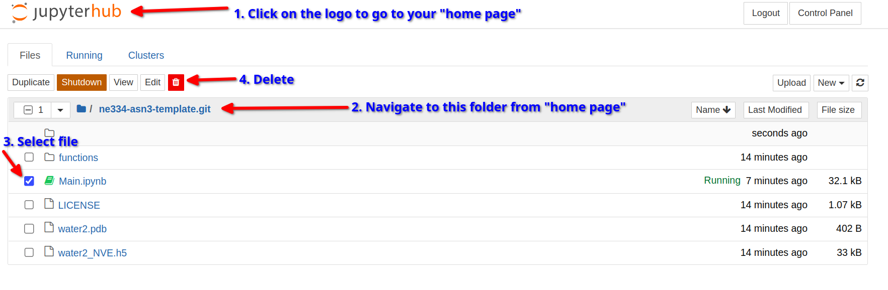

#### Welcome to your succinct guide on doing the thermo assignment without deepnote

> This is a thing I whipped up really quickly, dm me on discord if anything is not working properly.

Login first time to JupyterHub from the link on discord (I can't put it here for security reasons)

Signup using any username and password (save them for later)
  - Trying to login for the first time creates your account
  - You should be presented with a notebook to do the assignment
  - .... break a leg

**NOTE: you should not need to run the `conda` commands like the original assignment. These commands take very long to execute, so I already installed them for everybody**

---------------------------------

If you already did some work in Deepnote and want to move it over:
  - Option 1: You can copy over the few cells of code if you want.
  - Option 2: You can replace the default notebook using your own one from deepnote.
    - From deepnote you can download everything from three-dots at the top right.
    - Uncompress the zip file
    - In JupyterHub: Delete the `Main.ipynb` file like the instructions below
    - Upload your `Main.ipynb` from the unzipped folder to JupyterHub

